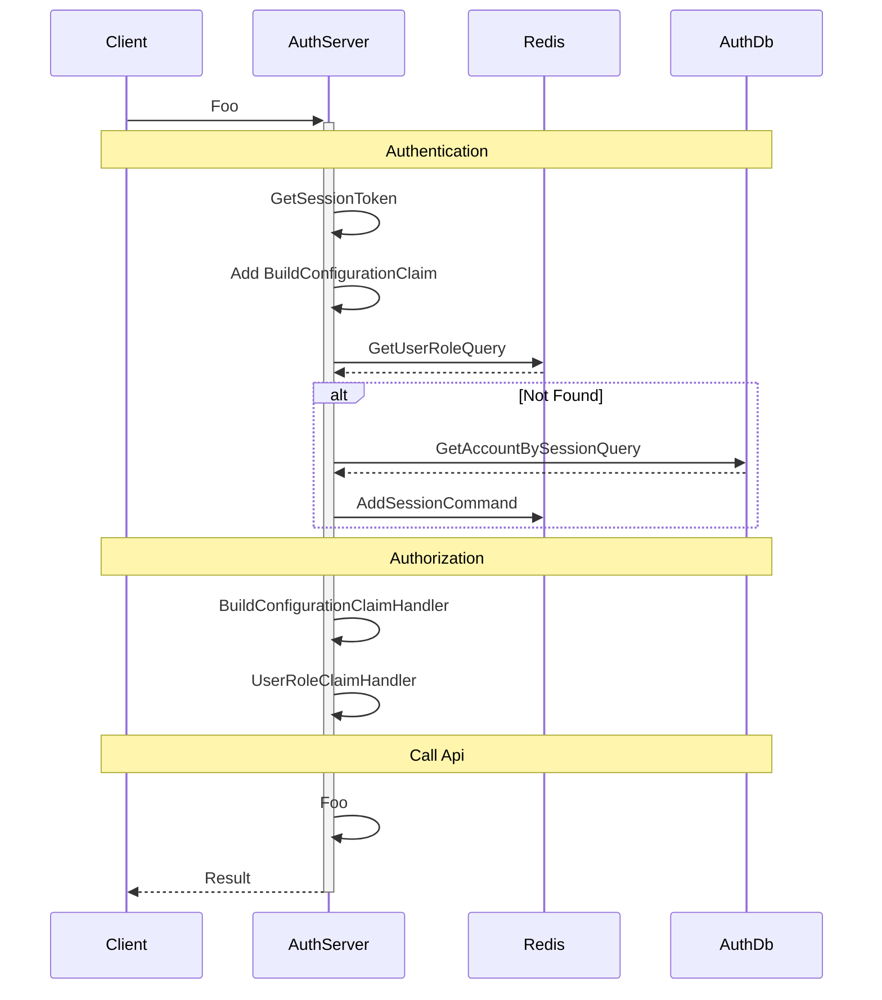

# AuthServer Api Call

```mermaid
sequenceDiagram
  participant Client
  participant AuthServer
  participant Redis
  participant AuthDb
  
  Client->>+AuthServer: Foo
  Note over Client, AuthDb: Authentication
  AuthServer->>AuthServer: GetSessionToken
  AuthServer->>AuthServer: Add BuildConfigurationClaim
  AuthServer->>Redis: GetUserRoleQuery
  Redis-->>AuthServer: 
  Alt Not Found
    AuthServer->>AuthDb: GetAccountBySessionQuery
    AuthDb-->>AuthServer: 
    AuthServer->>Redis: AddSessionCommand
  end

  Note over Client, AuthDb: Authorization
  AuthServer->>AuthServer: BuildConfigurationClaimHandler
  AuthServer->>AuthServer: UserRoleClaimHandler
  
  Note over Client, AuthDb: Call Api
  AuthServer->>AuthServer: Foo
  
  AuthServer-->>-Client: Result
```
1. 로그인시 부여받은 SessionId로 인증
2. 해당 SessionId의 UserRole에 따라 인가

만약 Redis에서 SessionId를 찾지 못했다면 AuthDb에서 얻어온 뒤, Redis에 기록한다.