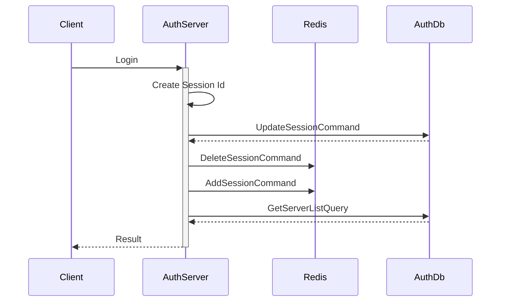

# Login

```mermaid
sequenceDiagram
  participant Client
  participant AuthServer
  participant Redis
  participant AuthDb
  
  Client->>+AuthServer: Login
  AuthServer->>AuthServer: Create Session Id
  AuthServer->>AuthDb: UpdateSessionCommand
  AuthDb-->>AuthServer: 
  AuthServer->>Redis: DeleteSessionCommand
  AuthServer->>Redis: AddSessionCommand
  AuthServer->>AuthDb: GetServerListQuery
  AuthDb-->>AuthServer: 
  
  AuthServer-->>-Client: Result
```
1. 기존 SessionId를 만료시킴
2. 새 SessionId를 기록
3. 새 SessionId와 접속 가능한 World List를 반환