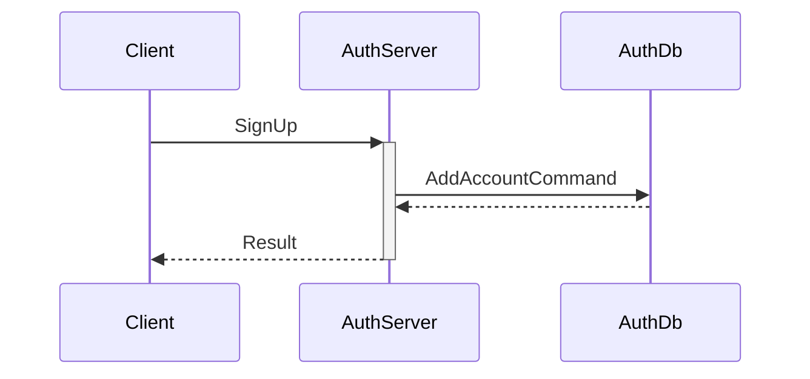

# Sign Up

```mermaid
sequenceDiagram
  participant Client
  participant AuthServer
  participant AuthDb

  Client->>+AuthServer: SignUp
  AuthServer->>AuthDb: AddAccountCommand
  AuthDb-->>AuthServer: 
  
  AuthServer-->>-Client: Result
```
서버는 UserRoles.User로 유저를 생성