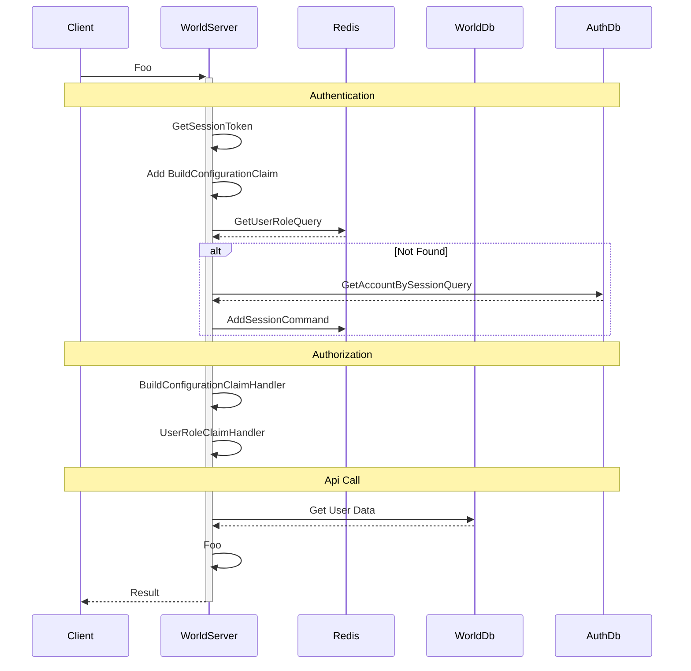

# WorldServer Api Call

```mermaid
sequenceDiagram
  participant Client
  participant WorldServer
  participant Redis
  participant WorldDb
  participant AuthDb
  
  Client->>+WorldServer: Foo
  Note over Client, AuthDb: Authentication
  WorldServer->>WorldServer: GetSessionToken
  WorldServer->>WorldServer: Add BuildConfigurationClaim
  WorldServer->>Redis: GetUserRoleQuery
  Redis-->>WorldServer: 
  Alt Not Found
    WorldServer->>AuthDb: GetAccountBySessionQuery
    AuthDb-->>WorldServer: 
    WorldServer->>Redis: AddSessionCommand
  end

  Note over Client, AuthDb: Authorization
  WorldServer->>WorldServer: BuildConfigurationClaimHandler
  WorldServer->>WorldServer: UserRoleClaimHandler
  
  Note over Client, AuthDb: Api Call
  WorldServer->>WorldDb: Get User Data
  WorldDb-->>WorldServer: 
  WorldServer->>WorldServer: Foo
  
  WorldServer-->>-Client: Result
```