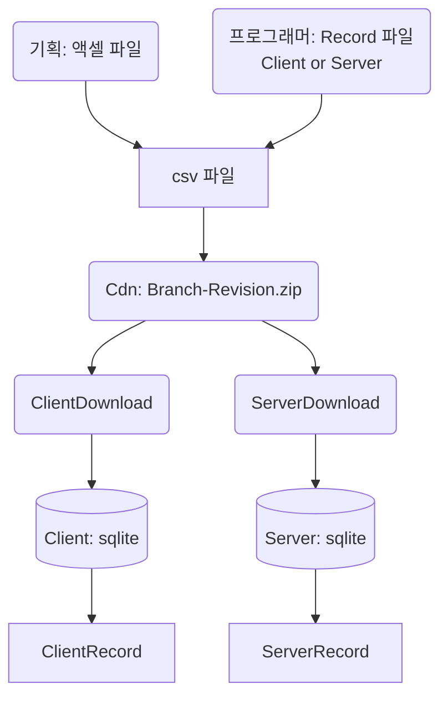

# StaticData Library

## 데이터 생성 및 사용 흐름

## 필요한 작업
* Excel To Csv Using Records : ETC
* Csv Load Tester : CLT
* Excel To DbClass Using Records : ETDB
* Redords Parser

## To Do List
* [ ] ETC-Server 개발 <- Run
* [ ] CsvLoadTester 개발
* [ ] ETDB-Server 개발
* [ ] Record Parser 개발하여 client 사이드도 동작하도록

## ETC
* 프로그래머가 릴리즈
* 기획이 사용

## CsvLoadTester
### Enum이 아닌 Data 만 추가된 경우
* CLT에서 에러가 발생하지 않음

### Enum이 추가되거나 컬럼이 변경된 경우
* CLT에서 에러가 발생
* 프로그래머가 조치한 뒤 ETC 및 LoadTester 배포

## ETDB
* 프로그래머가 사용
* Excel과 Records 둘 다 필요
* 생성된 클래스에 Key와 Index를 걸어준다
* 나아가 Key와 Index이외의 Select문이 있다면 유닛테스트에서 거르게 할 것

## Redords Parser

### 서버
StaticDataLibrary를 포함해서 ETDB와 ETC가 개발되므로 불필요

### 클라이언트
*.cs로 작성된 Record파일을 text로 읽어와 클래스 맴버의 컬럼명을 가져옴
컬럼명만 있으면 이후의 동작은 같음