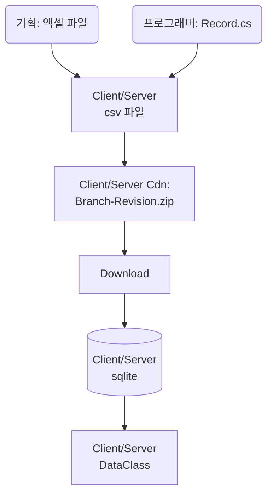

# StaticData Library

## 용어 정리
* Record : Excel의 Sheet에서 필요한 컬럼만 추려놓은 클래스
* Data : Record로 부터 생성되며 프로그래밍 처리에 용이하도록 가공된 클래스

## 데이터 생성 및 사용 흐름

1. 기획은 필요한 모든 데이터를 Excel에 자유롭게 작성
2. 프로그래머는 필요한 컬럼만 추려서 Record로 제작
3. 툴은 기획의 Excel을 csv로 변경해 sqlite에 넣고 Record가 Data가 되는 과정을 검증

## 이름 규칙 예제
* 기본형 : Data
* Record : DataRecord
* DbSet<DataRecord> : DataTable
* SheetName : 기본형. 혹은 SheetName 어트리뷰트 사용
* 
이 내용은 UnitTest에 의해 강요된다.